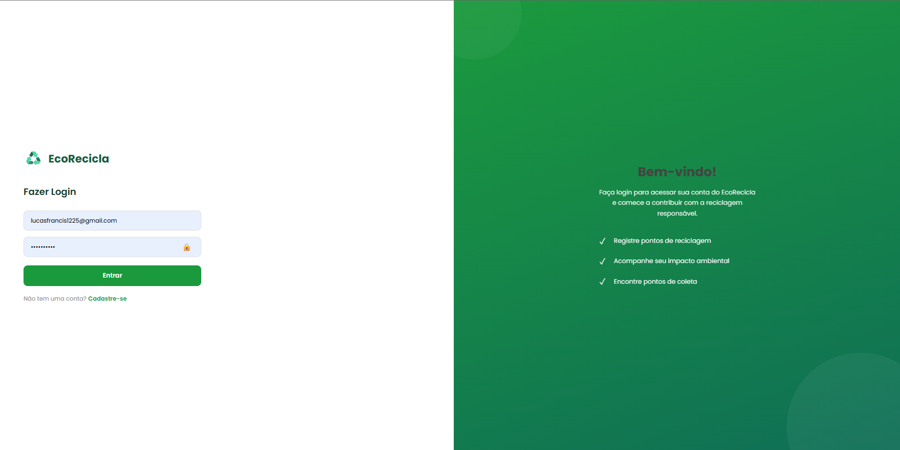
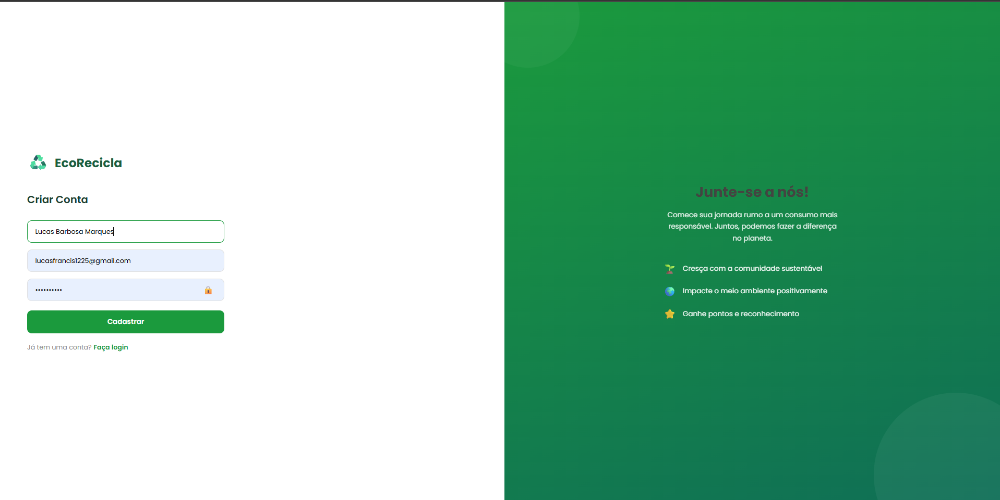
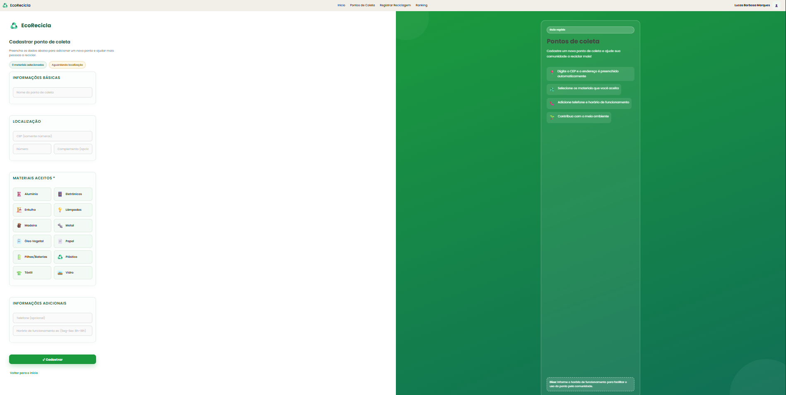
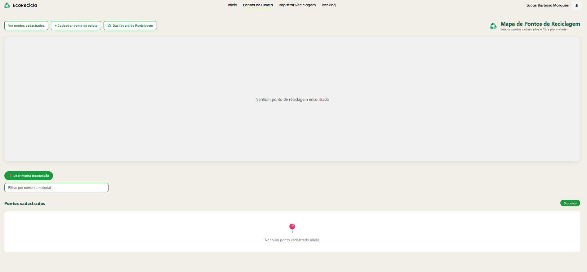
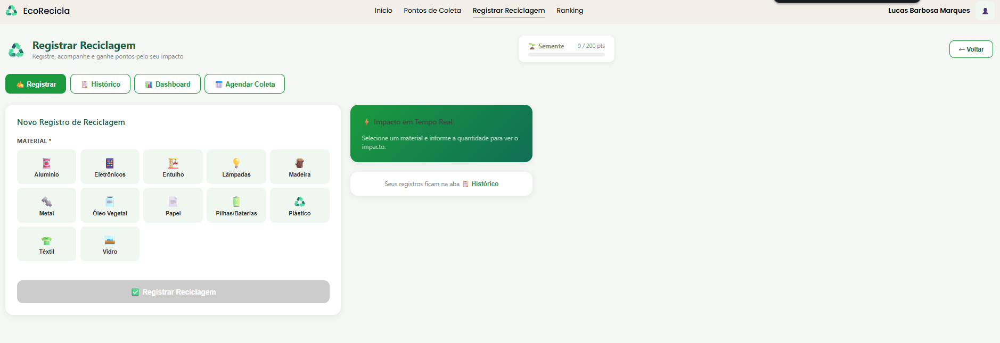
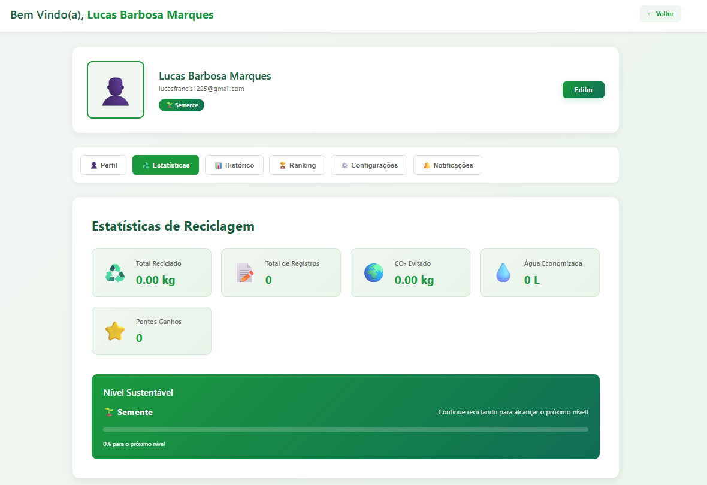
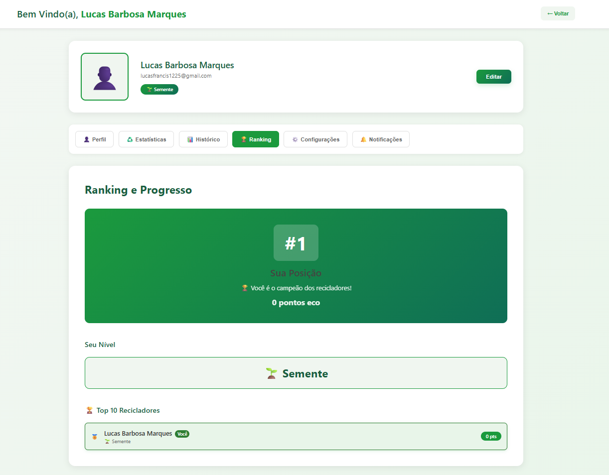
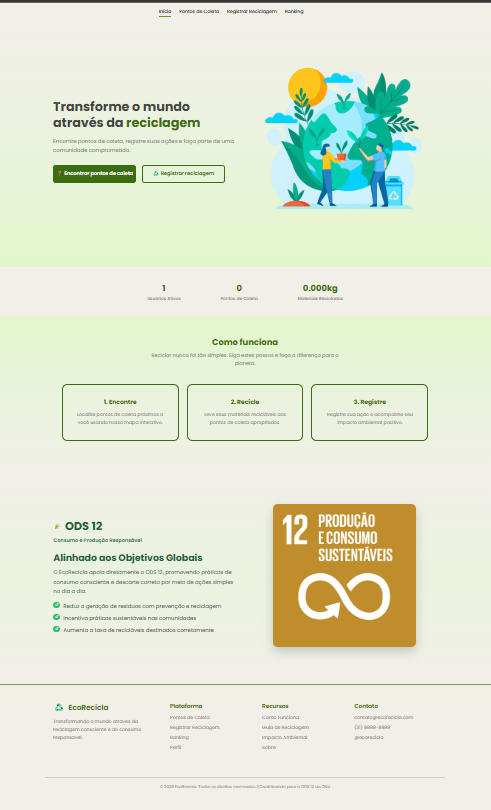
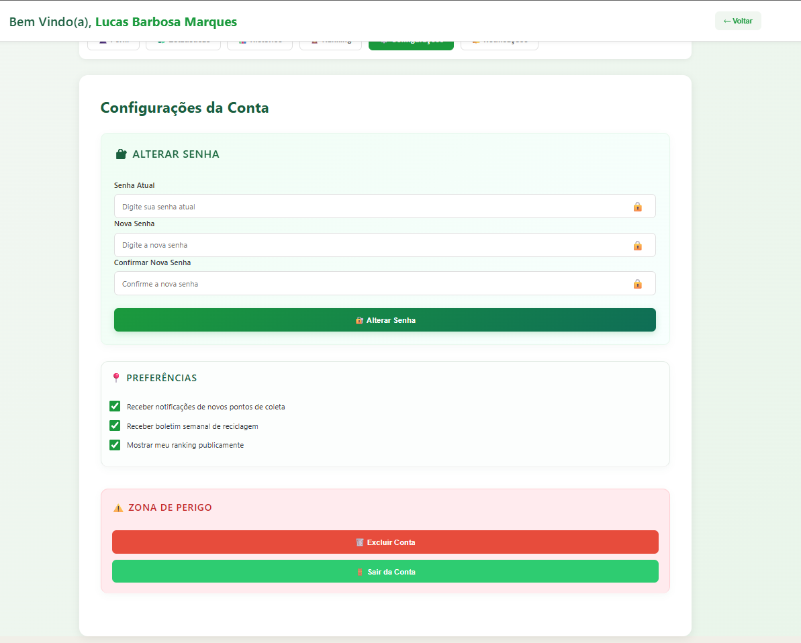
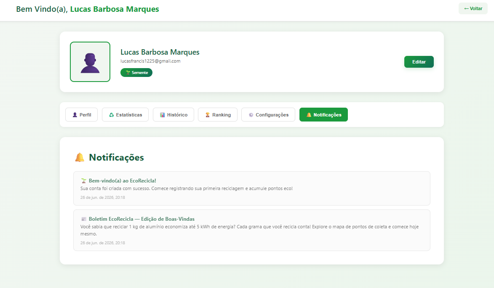

# 5. Interface do Sistema

Esta seção apresenta a evolução da interface do sistema **EcoRecicla** durante o desenvolvimento do projeto. As imagens demonstram as funcionalidades implementadas em cada Sprint, evidenciando a evolução visual e funcional da aplicação.

O objetivo da interface é proporcionar uma experiência simples, intuitiva e agradável aos usuários, incentivando a utilização da plataforma para promover práticas sustentáveis e o descarte consciente de resíduos recicláveis.

---

# 5.1 Galeria de Telas (Por Sprint)

## 🟢 Sprint 1 – Estrutura Inicial e Autenticação

### Funcionalidade

Implementação da estrutura inicial do sistema e do fluxo de autenticação dos usuários.

### Descrição

Nesta Sprint foram desenvolvidas as primeiras telas da aplicação, responsáveis pelo acesso dos usuários ao sistema.

### Tela de Login

Permite que usuários autenticados acessem a plataforma utilizando e-mail e senha.

### Tela de Cadastro

Permite que novos usuários criem uma conta para utilizar os recursos disponibilizados pelo EcoRecicla.

---

## 🟡 Sprint 2 – Gerenciamento dos Pontos de Coleta

### Funcionalidade

Cadastro e consulta dos pontos de coleta seletiva.

### Descrição

Nesta etapa foi implementada a funcionalidade responsável por cadastrar e visualizar os pontos de coleta disponíveis para descarte de materiais recicláveis.

### Cadastro de Ponto de Coleta

Tela utilizada para cadastrar novos pontos de coleta, contendo informações como nome, endereço, horário de funcionamento e materiais aceitos.

### Listagem de Pontos de Coleta

Apresenta todos os pontos cadastrados na plataforma, permitindo ao usuário localizar locais adequados para descarte.

---

## 🔵 Sprint 3 – Funcionalidades Principais

### Funcionalidade

Registro das reciclagens e acompanhamento do desempenho dos usuários.

### Descrição

Nesta Sprint foram implementadas as principais funcionalidades relacionadas às ações de reciclagem realizadas pelos usuários.

### Registro de Reciclagem

Permite registrar novos descartes de materiais recicláveis, informando o tipo de resíduo e sua quantidade.

### Estatísticas

Exibe indicadores relacionados ao desempenho do usuário, como quantidade reciclada, evolução e métricas ambientais.

### Ranking

Mostra os usuários com maior participação nas atividades de reciclagem, incentivando a competição saudável através da gamificação.

---

## 🔴 Sprint 4 – Polimento da Interface e Recursos Complementares

### Funcionalidade

Finalização da interface do sistema e implementação de recursos adicionais.

### Descrição

Na Sprint final foram realizados ajustes de usabilidade, organização visual e implementação das telas complementares que tornam a experiência do usuário mais completa.

### Página Inicial

Tela principal da aplicação, responsável por apresentar o projeto EcoRecicla e facilitar o acesso às funcionalidades disponíveis.

### Configurações

Permite ao usuário gerenciar informações da conta e personalizar suas preferências.

### Notificações

Centraliza avisos e mensagens importantes geradas pelo sistema durante sua utilização.

---

# Considerações Finais

Ao longo das quatro Sprints, a interface do EcoRecicla evoluiu de uma estrutura básica de autenticação para uma aplicação completa, contendo funcionalidades de gerenciamento de pontos de coleta, registro de reciclagem, acompanhamento estatístico e gamificação através do ranking dos usuários.

O desenvolvimento buscou manter uma identidade visual consistente, utilizando cores relacionadas à sustentabilidade, componentes padronizados e navegação intuitiva, proporcionando uma experiência simples e agradável para o usuário final.
