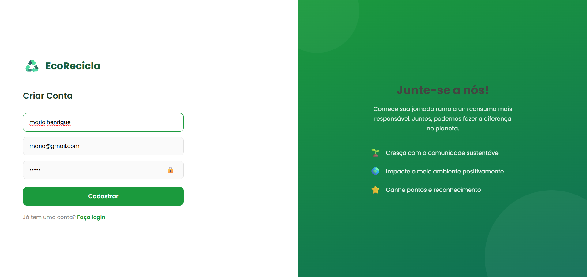
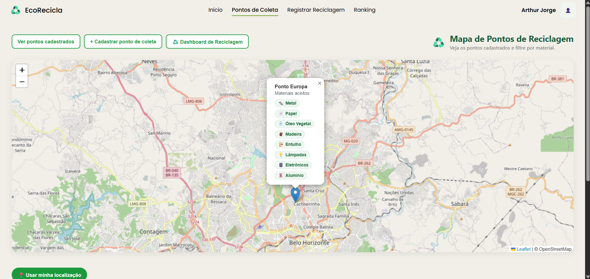
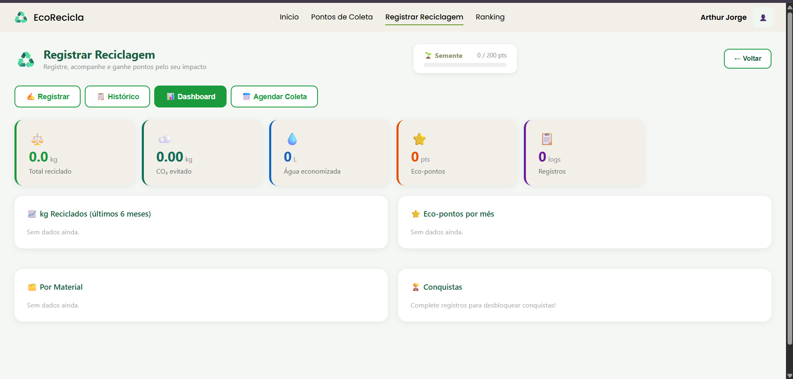

# 6. Teste de Usabilidade do Software

Nesta seção, abordaremos a realização do teste de usabilidade do software. O teste visa avaliar a eficácia, eficiência e a satisfação do usuário ao interagir com o sistema, garantindo que a interface e as funcionalidades atendam às necessidades do público-alvo.

---

## 6.1 Introdução

O sistema testado foi a plataforma **EcoRecicla**, uma aplicação web voltada ao incentivo da reciclagem consciente. A plataforma permite que usuários se cadastrem, façam login, localizem pontos de coleta em um mapa interativo, registrem reciclagens informando material e quantidade, e acompanhem seu impacto ambiental (CO₂ evitado, água economizada e eco-pontos acumulados) por meio de um painel personalizado.

O objetivo do teste foi avaliar se os usuários conseguiam navegar pela plataforma e realizar as principais tarefas disponíveis até a Sprint 3 com facilidade, sem necessidade de apoio técnico, identificando pontos de melhoria para as próximas entregas.

A avaliação foi realizada utilizando a metodologia **Escala SUS (System Usability Scale)**, aplicada com 5 participantes em sessões potenciais presenciais conduzidas pelos integrantes do Grupo 6.

---

## 6.2 Metodologia (Participantes e Tarefas)

### Participantes

Participaram do teste **5 usuários** com perfis variados, selecionados para representar diferentes níveis de familiaridade com sistemas digitais e sustentabilidade:

| Participante | Perfil | Descrição |
| :--- | :--- | :--- |
| Participante A | Novato | Sem experiência com plataformas web ou aplicativos de sustentabilidade |
| Participante B | Novato | Sem experiência com plataformas web ou aplicativos de sustentabilidade |
| Participante C | Intermediário | Usa aplicativos web com certa frequência, mas nunca utilizou plataformas de reciclagem |
| Participante D | Intermediário | Usa aplicativos web com certa frequência, mas nunca utilizou plataformas de reciclagem |
| Participante E | Experiente | Utiliza aplicativos web com frequência e tem familiaridade com plataformas de sustentabilidade |

### Tarefas Propostas

Cada participante foi orientado a realizar as seguintes tarefas, sem auxílio dos avaliadores durante a execução:

1. Realizar o cadastro de um novo usuário na plataforma.
2. Efetuar login com as credenciais cadastradas.
3. Localizar um ponto de coleta próximo utilizando o mapa interativo.
4. Registrar uma reciclagem informando o material e a quantidade.
5. Consultar o painel de reciclagem para verificar o impacto ambiental gerado.

### Procedimento

O teste foi aplicado presencialmente com acompanhamento dos integrantes do grupo. Cada participante teve entre 10 e 15 minutos para realizar as tarefas e, ao final, respondeu ao questionário oficial da **Escala SUS** (composto por 10 perguntas respondidas em uma escala Likert de 1 a 5).

---

## 6.3 Resultados

### Pontuações SUS por Participante

Abaixo estão consolidadas as pontuações finais obtidas por cada participante, calculadas a partir da conversão matemática individual das respostas do questionário SUS:

| Participante | Perfil | Pontuação SUS |
| :--- | :--- | :---: |
| Participante A | Novato | 70,0 |
| Participante B | Novato | 60,0 |
| Participante C | Intermediário | 82,5 |
| Participante D | Intermediário | 90,0 |
| Participante E | Experiente | 100,0 |
| **Média Geral** | — | **80,5** |

> 🏆 **Classificação SUS:** Média de 80,5 = **Excelente Usabilidade (Nível A)**

### Principais Descobertas

- A **maioria dos participantes** (4 de 5) realizou todas as tarefas sem necessidade de auxílio, comprovando que os fluxos fundamentais da aplicação estão logicamente estruturados.
- Os participantes **intermediários e o experiente** avaliaram muito positivamente a navegação pelo mapa de pontos de coleta e o processo de registro de reciclagem, destacando a clareza das informações de impacto ambiental exibidas após o registro.
- Os **participantes novatos** concluíram o cadastro e o login de forma célere, elogiando a simplicidade do formulário. Contudo, relataram dificuldade em localizar o painel de reciclagem na primeira utilização — o acesso pela barra de navegação não se mostrou intuitivo de imediato para quem não tem costume com sistemas.
- O tempo médio para completar todas as 5 tarefas planejadas foi de aproximadamente **12 minutes**.
- Nenhum participante reportou falhas críticas, quebras de layout impeditivas ou erros de sistema (bugs) que inviabilizassem a conclusão total do roteiro.

---

## 6.4 Sugestões de Melhoria

Com base nos resultados coletados e visando a evolução da plataforma para a **Sprint 4**, o grupo estabeleceu o seguinte plano de ação:

* **(-)** Tornar o acesso ao **Painel de Reciclagem** mais destacado na barra de navegação, pois usuários novatos demoraram para encontrá-lo. Recomenda-se o uso de um ícone mais evidente ou uma label textual mais direta (ex: "Meu Painel" ou "Minhas Reciclagens").
* **(-)** Incluir uma **notificação ou modal de confirmação visual mais claro** após o envio do formulário de reciclagem (ex: tela de sucesso com resumo detalhado do impacto gerado), reforçando o feedback do sistema.
* **(+)** O **fluxo de cadastro e login** cumpriu com maestria seu papel: rápido, direto, seguro e com poucos campos. Deve ser mantido exatamente na estrutura atual.
* **(+)** A **visualização do mapa interativo** foi elogiada pela fluidez e facilidade de identificação dos pontos de coleta por usuários intermediários e experientes. Será mantida e enriquecida futuramente com filtros avançados de materiais.
* **(+)** Os indicadores de **impacto ambiental** (CO₂ evitado, água economizada e ecopontos) foram apontados como excelentes gatilhos de gamificação e engajamento para fidelização dos usuários.

---

## 6.5 Registro Audiovisual (Evidências)

A comprovação da realização do teste prático de usabilidade com os usuários convidados está documentada abaixo por meio de capturas de tela e registros visuais coletados pelas equipes de aplicação:

*  - *Registro do participante novato preenchendo o formulário simplificado de cadastro na plataforma.*
*  - *Momento em que o Participante C realizou a busca e filtragem de pontos de coleta próximos.*
*  - *Dificuldade mapeada: Usuário procurando onde se localizava o painel de histórico de impacto na barra superior.*

---

## 6.6 Tabela Comparativa

Abaixo consta a comparação direta entre a expectativa que o Squad tinha durante a fase de prototipação e a realidade observada na prática durante a execução dos testes com os usuários:

| Tarefa | Expectativa do Squad | Realidade do Usuário |
| :--- | :--- | :--- |
| **Cadastro de usuário** | Processo simples, concluído em até 2 minutos | Todos os participantes concluíram em menos de 2 minutos; formulário elogiado pela simplicidade. |
| **Login** | Tarefa rápida e sem dificuldades | Nenhuma dificuldade relatada. Todos concluíram em menos de 1 minuto. |
| **Localizar ponto de coleta no mapa** | Tarefa intuitiva, concluída facilmente | Participantes intermediários e experiente concluíram sem dificuldades. Novatos precisaram de alguns segundos a mais para entender como interagir com o mapa. |
| **Registrar uma reciclagem** | Fluxo claro, concluído em até 3 minutos | Concluído por todos. Um participante novato não identificou de imediato qual material selecionar, mas concluiu sem ajuda externa. |
| **Consultar o painel de reciclagem** | Acesso fácil pelo menu de navegação | Os dois participantes novatos levaram mais tempo para encontrar a tela. Indicado como principal ponto de melhoria prioritário para a Sprint 4. |